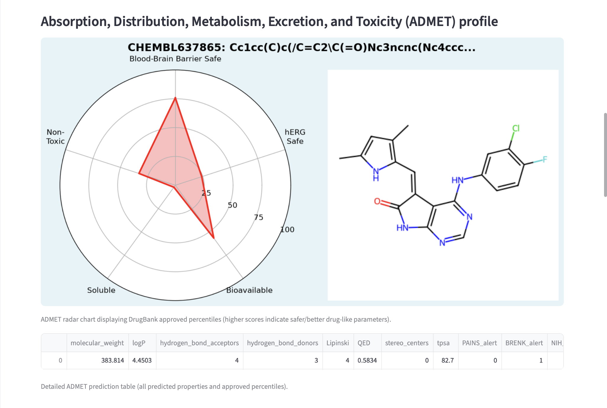
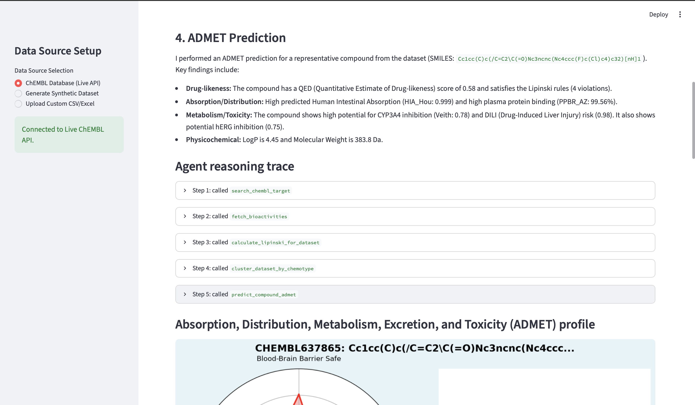
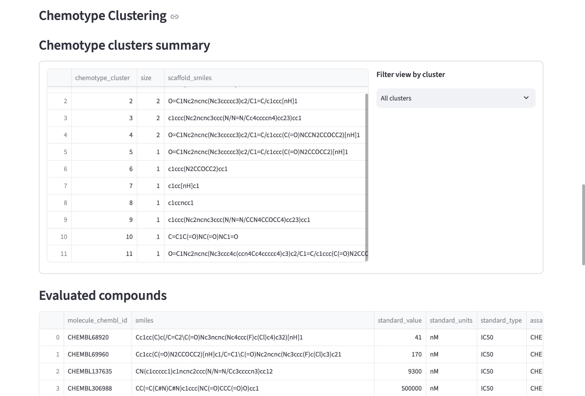
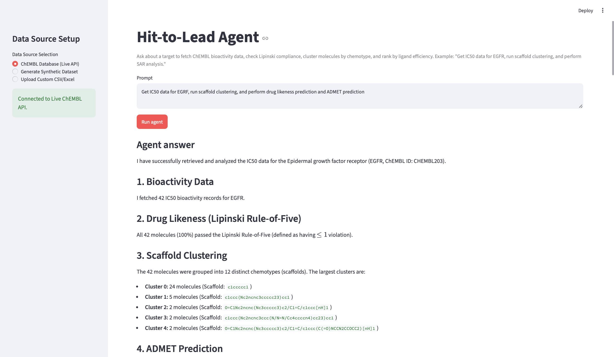

# Hit to Lead Agent

A natural language assistant for medicinal chemists to run analysis on drug screen data, filter down compound collections, and select lead molecules. 

The agent connects structured compound records (from ChEMBL or custom/synthetic LIMS uploads) with chemical intelligence (RDKit Lipinski Rule-of-Five checks, scaffold clustering, Ligand Efficiency SAR calculations, and ADMET property predictions using ADMET-AI) and semantic vector search (for unstructured comments/notes).

## Screenshots

| | | |
|---|---|---|
|  |  | |
|  |  | |

## Key Features

1. **Medicinal Chemistry Assistant**: Interacts with compound screens using natural language. For example: *"Which molecules targeting SMARCA2 have an IC50 < 1 uM and pass Lipinski rules?"* or *"Cluster the compounds and analyze the structure-activity relationship."*
2. **Unified Data Support**: Seamlessly queries the live **ChEMBL Database** or your own **Custom LIMS CSV/Excel** files. 
3. **In-Memory RAG & Pandas Execution**: Generates exact, secure pandas/RDKit operations on the fly for structured properties, and uses an in-memory **FAISS Vector RAG** to search free-text annotations/comments semantically.
4. **Interactive Dashboard**: Renders agent tool thought traces in real-time, displaying clean data tables and RDKit-drawn 2D molecular structures of the prioritized hits.
5. **Smart API Caching**: Automatically caches ChEMBL target searches and bioactivity fetches using Streamlit caching to speed up subsequent queries and save API quotas.
6. **Predictive ADMET Profiling**: Integrates local `ADMET-AI` predictions on compound SMILES, generating percentile profiles against DrugBank-approved drug space across key safety and pharmacological parameters.
7. **Fuzzy Target Recovery**: Incorporates a sub-agent target resolution layer to handle spelling errors and abbreviations in search target queries, automatically correcting inputs.

## Files

| File | Purpose |
|---|---|
| `app.py` | Main Streamlit application dashboard setting up page routing, sidebar uploads, main-thread synchronization, and molecular structures visualization. |
| `agent_tools.py` | Defines LangChain `@tool` interfaces (`fetch_bioactivities`, `query_uploaded_lims`, etc.), configures the system prompt, and builds the tool-calling agent. |
| `chembl_pipeline.py` | Fetches target metadata and bioactivity tables from the ChEMBL API, supported by in-memory query caching. |
| `synthetic_data.py` | Generates dummy LIMS datasets and standardizes custom CSV/Excel uploads (flexible mapping of column headers and unit conversion). |
| `lipinski_rules.py` | RDKit-based calculations for Molecular Weight, LogP, HBD, HBA, and Rule-of-Five violations. |
| `chemotype_clustering.py` | Groups molecules into chemotypes/families using Bemis-Murcko scaffolds or Butina similarity clustering. |
| `sar_analysis.py` | Computes Ligand Efficiency (LE) and ranks molecules/clusters to yield structural activity relationship summaries. |
| `admet_pred.py` | Runs ADMET-AI model predictions and generates polar radar plot visualizations of ADMET profile percentiles. |

## Setup

1. Clone the repository and navigate into the project directory:
   ```bash
   git clone https://github.com/your-username/H2L_Agent.git
   cd H2L_Agent
   ```
2. Create and activate a Python virtual environment:
   - **macOS/Linux**:
     ```bash
     python -m venv .venv
     source .venv/bin/activate
     ```
   - **Windows**:
     ```cmd
     python -m venv .venv
     .venv\Scripts\activate
     ```
3. Install the required packages:
   ```bash
   pip install -r requirements.txt
   ```
4. Set your Gemini API key in your environment:
   - **macOS/Linux**:
     ```bash
     export GEMINI_API_KEY="YOUR_API_KEY"
     ```
   - **Windows (Command Prompt)**:
     ```cmd
     set GEMINI_API_KEY="YOUR_API_KEY"
     ```
   - **Windows (PowerShell)**:
     ```powershell
     $env:GEMINI_API_KEY="YOUR_API_KEY"
     ```

## Run the dashboard

Start the Streamlit application:
```bash
streamlit run app.py
```

## How the Agent Works

The agent runs on a LangGraph-based tool-calling engine, bound to specialized tools:
- **`lookup_target_by_exact_name` & `search_chembl_target`**: Resolves target names against ChEMBL or local LIMS targets. If an exact match query fails (due to spelling mistakes or abbreviations like "egrf"), a custom LangGraph middleware wrapper (`FuzzyMatchRecoveryMiddleware`) intercepts the failure, invokes a downstream **Target Lookup Sub-Agent** (or programmatically falls back to `difflib.get_close_matches`) to resolve the closest valid target preferred name, overrides the query parameters on the fly, and re-executes the search seamlessly.
- **`fetch_bioactivities`**: Loads structured compound activity data (IC50, Ki, EC50) from ChEMBL or the active local dataset.
- **`calculate_lipinski_for_dataset`**: Calculates drug-likeness parameters and flags Lipinski violations.
- **`cluster_dataset_by_chemotype`**: Clusters molecules by core scaffolds (Bemis-Murcko) or fingerprint similarity (Butina).
- **`perform_sar_analysis`**: Calculates Ligand Efficiency and outputs a summary group ranking.
- **`query_uploaded_lims`**: Executes Python code on local datasets for custom queries (e.g. finding minimum values, column filtering).
- **`search_uploaded_notes`**: Semantically searches text comments/notes in local uploads using FAISS embeddings.
- **`predict_compound_admet`**: Evaluates chemical ADMET properties using the `admet_ai` package. It leverages a local ADMET-AI model wrapper to compute approved DrugBank percentiles across five key pharmacology axes (BBB safety, ClinTox toxicity, AqSolDB solubility, Ma bioavailability, and hERG safety), generates a dual-panel matplotlib visualization (polar radar plot side-by-side with an RDKit 2D molecular drawing), and caches/synchronizes both the chart and a detailed predictions table to render in the dashboard UI.
